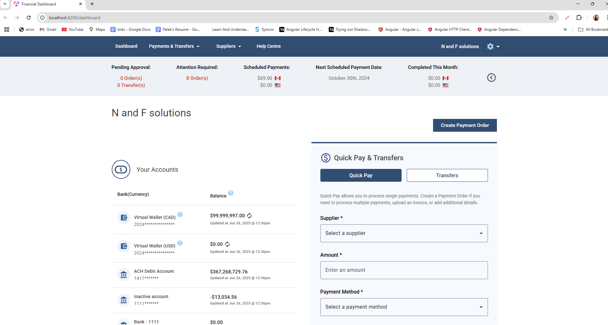
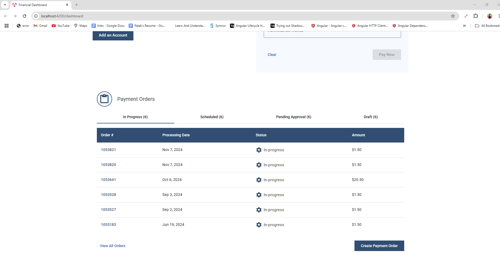
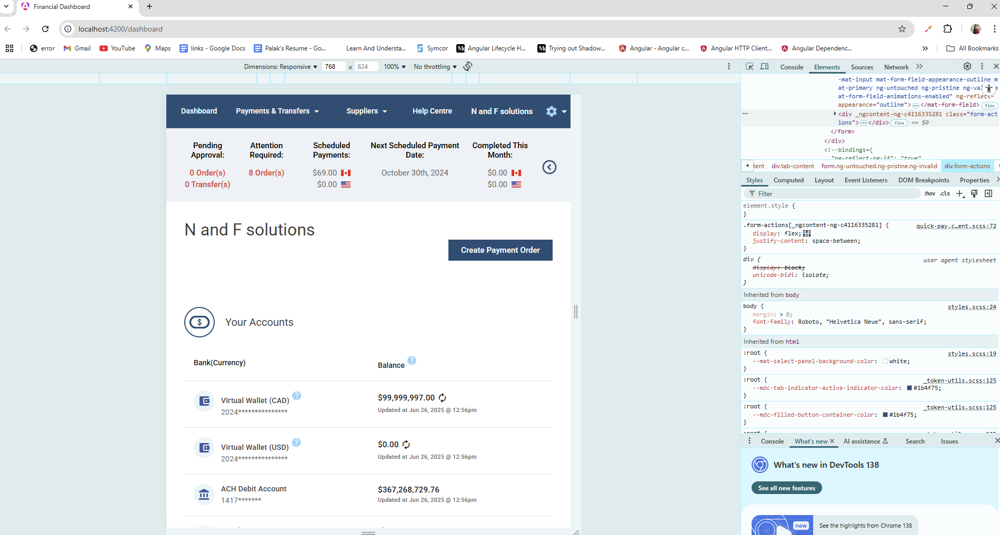
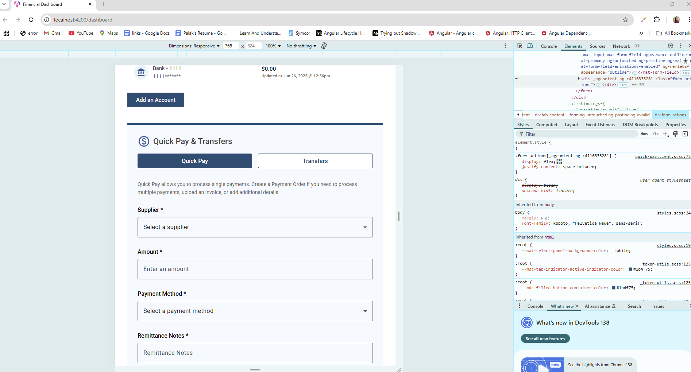
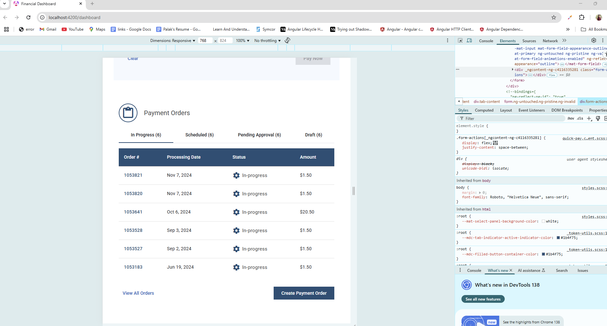

# Financial Dashboard

This project was generated with [Angular CLI](https://github.com/angular/angular-cli) version 19.2.5 with Node Version- 20 .

## Development server
- Clone the repository and cd into the folder `financial-dashboard`
- Before serving this app, you need to install Node Modules by command  `npm install` in terminal.
- Run `ng serve` for a dev server. Navigate to `http://localhost:4200/`.

## Application Architecture
1. This app implements provided wireframe into an Angular 19 app using standalone components and Angular Material
1. This app is made responsive using flexbox and adapted for Desktop (XL & L) and tablet devices
1. This Application also using scss styling which help define global style variables in `assets/variables.scss`
1. Based on provided wireframe the application is divided into 4 major blocks
    1. Components- Contains reusable components of the application
    1. Services - Responsible to fetch mock data
    1. Shared - Stores shared logic and models
    1. Assets-  Stores Global Static contents and styles
  
  ### Components 
    1. The Dashboard component serves as the root component, and users are redirected to it by default via Angular routing.
    1. Dashboard displays 5 components - Header, Dashboard Stats, Accounts, Quick Pay, Payment Orders
    1. Header component is using Mat Toolbar and consists of two sections, Nav items and User section
    1. Dashboard Stat component is fetches mock data from dashboard service and displays each stat dynamically. It also uses Material Icons and Img icons for country flags. It uses currency pipes to display correct format for currency.
    1. Accounts component uses Material table to display user accounts by passing dataSource to the table which is subscribed from the observable. It also uses conditional styling to display mat-help-icon based on account type. A date pipe is used to format date in UI. The border of last child of table is removed using css last-child psuedo class
    1. Quick Pay Component uses Reactive form and adds validators with inline error messages. It also consists of Tab-like navigation based on Tab selected and it utilizes ngClass to dynamically change the content and button styles. By default Pay button is disabled and enabled only when validators are passed.
    1. Payment Orders Component Displays Material Table based on Tabs clicked. By default it shows In-Progress Tab. The table data is subcribed from service. 

  ### Services 
    1. A DashboardService is implemented to simulate fetching mock data using Observables, with data types defined by TypeScript interfaces in the Shared folder.
    1. This Dashboard Service is injected in Components to get the Data by subcribing the observables
    1. The Components Dashboard-stats, Accounts, Payment-orders utilize this service and displays error if the call fails
 
  ### Shared 
    1. Shared folder consists of Typescript Interfaces used by the application to have mocked typed response

  ### Assets 
    1. Assets consist of `variables.scss` that defines global variables used by the applicaton

Screenshots are Attached: 
Desktop: 

Tablet:

